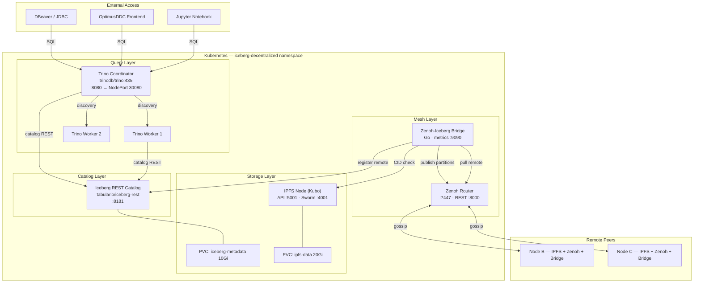
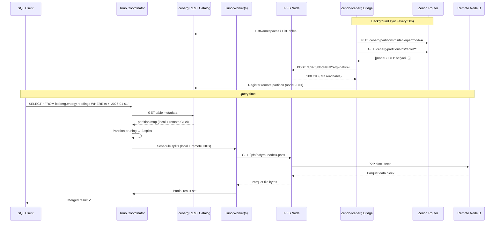
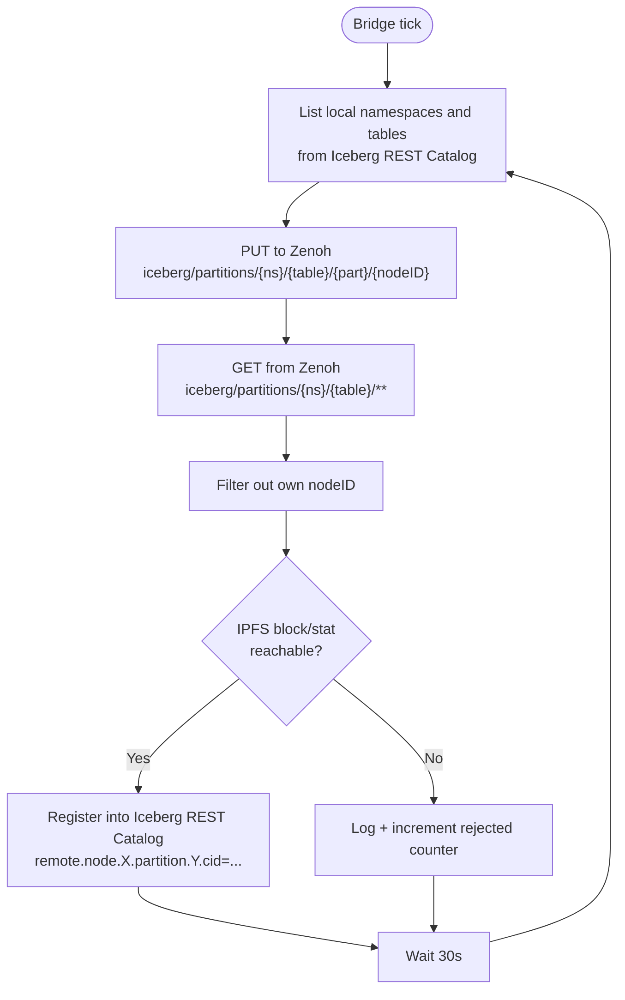

# iceberg-decentralized

> **A decentralized analytics platform** — Trino querying Apache Iceberg tables stored on IPFS, peers discovered via Zenoh, all wired together by a lightweight Go bridge service. Deployable on K3s with a single Helm command.

[](https://helm.sh)
[](https://kubernetes.io)
[](https://k3s.io)
[](https://golang.org)
[](LICENSE)

---

## Table of Contents

- [Concept](#concept)
- [Why Decentralized?](#why-decentralized)
- [Architecture](#architecture)
  - [System Overview](#system-overview)
  - [Query Execution Flow](#query-execution-flow)
  - [Bridge Sync Loop](#bridge-sync-loop)
- [Components](#components)
- [Prerequisites](#prerequisites)
- [Quick Start](#quick-start)
- [Configuration](#configuration)
- [How a Decentralized Query Works](#how-a-decentralized-query-works)
- [Building the Bridge](#building-the-bridge)
- [Connecting External Tools](#connecting-external-tools)
- [Troubleshooting](#troubleshooting)
- [Roadmap](#roadmap)

---

## Concept

Traditional analytics stacks assume a **single source of truth**: one metastore, one storage bucket, one coordinator that knows everything. This works until data is naturally distributed — across edge nodes, research clusters, federated organizations, or peer-to-peer networks.

**iceberg-decentralized** addresses this by combining four open-source technologies into a cohesive stack:

| Role | Technology | Why |
|------|-----------|-----|
| **Query engine** | [Trino 435](https://trino.io) | Distributed SQL, Iceberg-native, federation-ready |
| **Table format** | [Apache Iceberg 1.4](https://iceberg.apache.org) | ACID, time-travel, schema evolution, partition pruning |
| **Content-addressed storage** | [IPFS / Kubo 0.26](https://github.com/ipfs/kubo) | Data files referenced by CID — location-independent |
| **Peer messaging & discovery** | [Zenoh 0.11](https://zenoh.io) | Sub-millisecond pub/sub, works across NAT, edge-to-cloud |
| **The glue** | [`zenoh-iceberg-bridge`](bridge/) (Go) | Publishes local partitions to Zenoh; pulls & verifies remote ones |

The result: **any node in the mesh can issue a SQL query that transparently spans data held on other nodes**, with no central registry, no shared filesystem, and no single point of failure.

---

## Why Decentralized?

```
Centralized (classic):              Decentralized (this project):

  Client                              Client A      Client B
    │                                   │               │
    ▼                                   ▼               ▼
  Coordinator ── Metastore           Node 1 ──── Node 2 ──── Node 3
    │               │                  │               │           │
    └─► S3/HDFS ◄───┘               IPFS CID    IPFS CID    IPFS CID
                                       │               │           │
                                    Zenoh mesh (partition gossip)
```

**Centralized problems this solves:**
- Metastore as single point of failure
- All data must flow to one region/cluster
- No query capability when the coordinator is unreachable
- Federated datasets require ETL into a central lake

---

## Architecture

### System Overview



---

### Query Execution Flow



---

### Bridge Sync Loop



---

## Components

### Trino (Query Engine)
Distributed SQL query engine. Acts as the SQL interface for DBeaver, Jupyter, or OptimusDDC. The coordinator builds execution plans with partition pruning and delegates scanning to workers. Workers fetch Parquet files from IPFS and return partial results.

**Configuration** (mounted from ConfigMaps):
- `/etc/trino/config.properties` — coordinator/worker mode, discovery URI, memory limits
- `/etc/trino/jvm.config` — heap size, GC settings
- `/etc/trino/catalog/iceberg.properties` — Iceberg REST catalog connector

### Apache Iceberg (Table Format)
Open table format providing ACID transactions, time-travel, schema evolution, and partition pruning. Metadata lives in the `iceberg-metadata` PVC. Data files (Parquet) are content-addressed CIDs on IPFS.

### IPFS / Kubo (Content-Addressed Storage)
Stores data by content hash (CID). A CID refers to exactly one piece of data, regardless of which node holds it — making Iceberg data files inherently location-independent.

### Zenoh (Peer Messaging & Discovery)
Pub/sub/query protocol for edge-to-cloud data distribution. In `router` mode it acts as a relay for peers across different K3s hosts or network segments. Used as the **gossip bus** for partition announcements.

### Zenoh-Iceberg Bridge (The Glue)
The architectural piece that was missing from every other similar stack. Runs on every node, performs two jobs every sync interval:

1. **Publish** — read local Iceberg catalog → announce each table's partition map to Zenoh
2. **Sync** — query Zenoh for remote announcements → verify each CID is reachable via IPFS → register valid ones into the local Iceberg REST catalog

This gives Trino a complete, eventually-consistent view of all partitions across the mesh — without any central coordinator or shared filesystem.

---

## Prerequisites

| Requirement | Version | Notes |
|-------------|---------|-------|
| Kubernetes | 1.25+ | K3s recommended |
| Helm | 3.x | `helm version` |
| `local-path` StorageClass | any | Default in K3s |
| Docker | 20+ | To build the bridge image |
| `kubectl` | matching cluster | For verification |

---

## Quick Start

### 1. Clone the repository

```bash
git clone https://github.com/georgeGeorgakakos/optimusICE.git
cd optimusICE
```

### 2. Build and load the bridge image

```bash
cd bridge
docker build -t optimusdb/zenoh-iceberg-bridge:0.1.0 .

# K3s — import directly
docker save optimusdb/zenoh-iceberg-bridge:0.1.0 | k3s ctr images import -
cd ..
```

### 3. Install the Helm chart

```bash
helm install iceberg-decentralized . \
  --namespace iceberg-decentralized \
  --create-namespace \
  --wait
```

### 4. Verify all pods are running

```bash
kubectl get pods -n iceberg-decentralized

# Expected:
# trino-coordinator-xxx       1/1   Running
# trino-worker-xxx-1          1/1   Running
# trino-worker-xxx-2          1/1   Running
# ipfs-node-xxx               1/1   Running
# zenoh-xxx                   1/1   Running
# iceberg-rest-catalog-xxx    1/1   Running
# zenoh-iceberg-bridge-xxx    1/1   Running
```

### 5. Connect and run your first query

```bash
# Port-forward or use NodePort
trino --server http://<node-ip>:30080
```

```sql
-- Create a schema
CREATE SCHEMA IF NOT EXISTS iceberg.energy
WITH (location = '/iceberg-warehouse/energy');

-- Create a partitioned Iceberg table
CREATE TABLE IF NOT EXISTS iceberg.energy.readings (
    ts        TIMESTAMP(6),
    node_id   VARCHAR,
    metric    VARCHAR,
    value     DOUBLE
)
WITH (
    format = 'PARQUET',
    partitioning = ARRAY['day(ts)']
);

-- Insert data
INSERT INTO iceberg.energy.readings
VALUES (CURRENT_TIMESTAMP, 'node-1', 'solar_output_kw', 42.5);

-- Query across nodes transparently
SELECT * FROM iceberg.energy.readings
WHERE ts > TIMESTAMP '2026-01-01 00:00:00';

-- Time-travel
SELECT * FROM iceberg.energy.readings
FOR VERSION AS OF 1234567890;
```

### 6. Check the bridge sync logs

```bash
kubectl logs -n iceberg-decentralized deploy/zenoh-iceberg-bridge -f

# [INFO] published energy.readings (snapshot 8827364...)
# [INFO] registered remote partition energy.readings from node-2 (CID: bafyrei...)
```

---

## Configuration

All configuration is in `values.yaml`. Key knobs:

| Key | Default | Description |
|-----|---------|-------------|
| `namespace` | `iceberg-decentralized` | K8s namespace |
| `iceberg.storage.size` | `10Gi` | Iceberg warehouse PVC size |
| `iceberg.storage.storageClassName` | `local-path` | StorageClass; use shared class for multi-node |
| `ipfs.enable` | `true` | Deploy IPFS node |
| `ipfs.storage.size` | `20Gi` | IPFS block store PVC size |
| `zenoh.mode` | `router` | `router` (relay) or `peer` (direct, single-host) |
| `trino.workers.replicas` | `2` | Trino worker count |
| `trino.nodePort.enable` | `true` | Expose Trino externally |
| `trino.nodePort.port` | `30080` | NodePort number |
| `bridge.syncIntervalSeconds` | `30` | Partition gossip frequency |

---

## How a Decentralized Query Works

### Phase 1 — Discovery (Zenoh background gossip)

Every node continuously publishes its partition map into the Zenoh mesh:

```
Node A: PUT iceberg/partitions/energy/readings/day=2026-01-15/nodeA
        {"cid": "bafyreiabc...", "snapshot_id": 9012345}

Node B: PUT iceberg/partitions/energy/readings/day=2026-01-16/nodeB
        {"cid": "bafyreidef...", "snapshot_id": 9012399}
```

The bridge on each node receives the other's announcements, verifies the CID is reachable via IPFS, then registers it into the local Iceberg REST catalog.

### Phase 2 — Planning (Trino catalog lookup)

Trino fetches the full partition map from the catalog (now including remote CIDs), applies partition pruning, and generates a query plan with one split per relevant partition.

### Phase 3 — Execution (IPFS data retrieval)

Workers execute splits concurrently. Remote partition files are fetched transparently via IPFS content addressing — any node that holds the block can serve it.

---

## Building the Bridge

The bridge has **no external Go dependencies** — stdlib only.

```bash
cd bridge

# Build locally
go build -o bridge-local .

# Run locally (requires Zenoh, IPFS, Iceberg REST running)
ZENOH_ENDPOINT=tcp/localhost:7447 \
CATALOG_ENDPOINT=http://localhost:8181 \
IPFS_API=http://localhost:5001 \
SYNC_INTERVAL_SECONDS=10 \
NODE_ID=dev-node \
./bridge-local

# Build Docker image
docker build -t optimusdb/zenoh-iceberg-bridge:0.1.0 .

# Cross-compile for arm64
GOOS=linux GOARCH=arm64 CGO_ENABLED=0 go build -o bridge-arm64 .
```

### Bridge environment variables

| Variable | Default | Description |
|----------|---------|-------------|
| `ZENOH_ENDPOINT` | `tcp/zenoh:7447` | Zenoh router address |
| `CATALOG_ENDPOINT` | `http://iceberg-rest-catalog:8181` | Iceberg REST catalog URL |
| `IPFS_API` | `http://ipfs-node:5001` | IPFS Kubo API URL |
| `SYNC_INTERVAL_SECONDS` | `30` | Seconds between sync cycles |
| `NODE_ID` | `unknown-node` | Injected from `spec.nodeName` in K8s |
| `METRICS_PORT` | `9090` | Prometheus metrics port |

---

## Connecting External Tools

### DBeaver
1. New connection → Trino
2. Host: `<k3s-node-ip>`, Port: `30080`
3. Database: `iceberg`

### Jupyter Notebook
```python
from sqlalchemy import create_engine
engine = create_engine("trino://user@<node-ip>:30080/iceberg")
df = pd.read_sql("SELECT * FROM energy.readings LIMIT 100", engine)
```

### OptimusDDC
```
trino://trino-coordinator.iceberg-decentralized.svc:8080/iceberg
```

---

## Troubleshooting

**Pods stuck in `ContainerCreating`**
```bash
kubectl describe pod -n iceberg-decentralized <pod-name>
# Check storageClass exists: kubectl get storageclass
```

**Trino workers not registering**
```bash
kubectl logs -n iceberg-decentralized deploy/trino-coordinator | grep -i discovery
kubectl get svc -n iceberg-decentralized trino-coordinator
```

**Bridge showing `CID unreachable` warnings**
```bash
kubectl exec -n iceberg-decentralized deploy/ipfs-node -- ipfs swarm peers
# IPFS swarm may not be peered yet — wait ~60s after startup
```

**Zenoh peers not discovering across nodes**
```bash
kubectl port-forward -n iceberg-decentralized svc/zenoh 8000:8000 &
curl http://localhost:8000/@/router/local | jq .
# Ensure mode: router in values.yaml
```

---

## Roadmap

- [ ] IPFS-native Iceberg FileIO (write data files directly as CIDs)
- [ ] Multi-node Helm value overlays
- [ ] OPA access control integration
- [ ] Prometheus + Grafana dashboard
- [ ] Arm64 Docker image for Raspberry Pi K3s clusters
- [ ] OptimusDB GossipSub mesh as Zenoh alternative

---

## License

MIT — see [LICENSE](LICENSE).

---

> Built as part of the [OptimusDB](https://github.com/optimusdb/optimusdb) research stack.  
> Research affiliation: ICCS-NTUA, Swarmchestrate Project (Grant #101135012).
