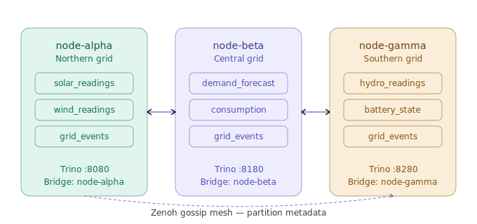

# OptimusDB — Decentralized Energy Grid Scenario

**Project:** OptimusDB / optimusICE — Swarmchestrate Grant #101135012
**Stack:** Trino 435 · Apache Iceberg · IPFS Kubo · Zenoh · Go Bridge
**Deployment:** Three-node Docker Desktop simulation

---

## Table of Contents

1. [Overview](#overview)
2. [Architecture](#architecture)
3. [Node Map](#node-map)
4. [What Makes This Decentralized](#what-makes-this-decentralized)
5. [Scenario: Smart Energy Grid](#scenario-smart-energy-grid)
6. [Schema: All Tables](#schema-all-tables)
7. [Setup: Ingest Data on Each Node](#setup-ingest-data-on-each-node)
8. [Decentralized Query Scenarios](#decentralized-query-scenarios)
   - [Scenario 1 — Grid balance check](#scenario-1--grid-balance-check)
   - [Scenario 2 — No central authority](#scenario-2--no-central-authority)
   - [Scenario 3 — Cross-node alert](#scenario-3--cross-node-alert)
   - [Scenario 4 — Data sovereignty / node offline](#scenario-4--data-sovereignty--node-offline)
   - [Scenario 5 — Cross-node event correlation](#scenario-5--cross-node-event-correlation)
9. [grid_events: The Shared Event Table](#grid_events-the-shared-event-table)
10. [Deploy Commands](#deploy-commands)
11. [Verify the Mesh](#verify-the-mesh)
12. [Port Reference](#port-reference)

---

## Overview

This scenario simulates a **decentralized smart energy grid** operated by three independent
regional grid operators. Each operator runs a fully sovereign node — their data never leaves
their own storage. Yet any node can query data owned by the others, in real time, using
standard SQL via Trino.

No central database. No central authority. No single point of failure.

The three nodes represent:

| Node | ID | Region | Owns |
|------|----|--------|------|
| node-alpha | `node-alpha` | Northern grid | Solar + wind generation |
| node-beta  | `node-beta`  | Central grid  | Demand forecasts + consumption |
| node-gamma | `node-gamma` | Southern grid | Hydro + battery storage |

---







## Architecture

```
┌─────────────────────────────────────────────────────────────────────┐
│                    iceberg-mesh  (Docker network)                    │
│                                                                      │
│  ┌──────────────────┐    Zenoh gossip    ┌──────────────────┐       │
│  │   node-alpha     │◄──────────────────►│   node-beta      │       │
│  │  Northern grid   │                    │  Central grid    │       │
│  │                  │◄──────────────────►│                  │       │
│  │  solar_readings  │    Zenoh gossip    │  demand_forecast │       │
│  │  wind_readings   │                    │  consumption     │       │
│  │  grid_events     │                    │  grid_events     │       │
│  │                  │                    │                  │       │
│  │  Trino  :8080    │                    │  Trino  :8180    │       │
│  │  Bridge :9090    │                    │  Bridge :9190    │       │
│  │  Zenoh  :7447    │                    │  Zenoh  :7547    │       │
│  └──────────────────┘                    └──────────────────┘       │
│           ▲                                       ▲                  │
│           │           Zenoh gossip                │                  │
│           └──────────────────┬────────────────────┘                 │
│                              │                                       │
│                   ┌──────────▼───────────┐                          │
│                   │   node-gamma         │                          │
│                   │  Southern grid       │                          │
│                   │                      │                          │
│                   │  hydro_readings      │                          │
│                   │  battery_state       │                          │
│                   │  grid_events         │                          │
│                   │                      │                          │
│                   │  Trino  :8280        │                          │
│                   │  Bridge :9290        │                          │
│                   │  Zenoh  :7647        │                          │
│                   └──────────────────────┘                          │
└─────────────────────────────────────────────────────────────────────┘

Each node also contains:
  ├── IPFS node      (content-addressed storage for Parquet files)
  ├── Iceberg catalog (local REST catalog, filesystem-backed)
  └── 2× Trino workers
```

---

## Node Map

```
┌────────────────────┬──────────────┬──────────────┬──────────────┐
│ Service            │ node-alpha   │ node-beta    │ node-gamma   │
├────────────────────┼──────────────┼──────────────┼──────────────┤
│ Trino SQL          │ :8080        │ :8180        │ :8280        │
│ Iceberg catalog    │ :8181        │ :8281        │ :8381        │
│ IPFS API           │ :5001        │ :5101        │ :5201        │
│ IPFS Gateway       │ :8888        │ :8988        │ :9088        │
│ Zenoh protocol     │ :7447        │ :7547        │ :7647        │
│ Zenoh REST         │ :8000        │ :8100        │ :8200        │
│ Bridge metrics     │ :9090        │ :9190        │ :9290        │
└────────────────────┴──────────────┴──────────────┴──────────────┘
```

Connect to any node's Trino with the CLI:

```powershell
# node-alpha
docker exec -it iceberg-trino-coordinator-node-a trino

# node-beta
docker exec -it iceberg-trino-coordinator-node-b trino

# node-gamma
docker exec -it iceberg-trino-coordinator-node-c trino
```

---

## What Makes This Decentralized

```
Traditional (centralised):                 OptimusDB (decentralised):

  Operator A ─┐                              Operator A
  Operator B ─┼──► Central DB ◄── queries    owns its data
  Operator C ─┘    (single owner,            Operator B         Zenoh mesh
                    single point             owns its data  ◄──────────────►
                    of failure)              Operator C         (partition
                                             owns its data       metadata)
                                                    │
                                             IPFS swarm
                                          (actual data files,
                                           content-addressed)
```

**Key properties:**

- Each operator owns their data **physically** — Northern grid data never leaves node-alpha's
  warehouse volume.
- The bridges publish only **metadata** (partition file locations as IPFS CIDs) over the Zenoh
  mesh — not the actual data.
- Any node can run any cross-region query using that metadata to locate and read the Parquet
  files directly via IPFS.
- When node-beta writes a new partition, within 30 seconds (`SYNC_INTERVAL_SECONDS`) the other
  nodes know about it and can query it.
- If one node goes offline, the others keep operating — there is no master.

---

## Scenario: Smart Energy Grid

Three regional grid operators need to coordinate:

- **node-alpha (Northern)** has abundant solar and wind generation data
- **node-beta (Central)** has consumption forecasts and real-time demand readings
- **node-gamma (Southern)** has hydro generation and battery storage state

Questions that require **all three** to answer:
- Is the grid currently in surplus or deficit?
- When should batteries charge vs discharge?
- If a fault occurs on one node, which other node's assets can compensate?
- What caused a brownout — was it a demand spike or a generation drop?

None of these questions can be answered by any single operator alone. In a centralised
system, all operators would push data into one warehouse owned by a fourth party. Here,
they query each other directly.

---

## Schema: All Tables

### node-alpha — Northern grid

```sql
-- Solar generation readings
CREATE TABLE iceberg.northern.solar_readings (
  ts        TIMESTAMP(6),   -- measurement time
  panel_id  VARCHAR,        -- panel identifier
  kwh       DOUBLE,         -- energy generated this interval
  region    VARCHAR         -- always 'north'
) WITH (
  format       = 'PARQUET',
  partitioning = ARRAY['day(ts)']
);

-- Wind generation readings
CREATE TABLE iceberg.northern.wind_readings (
  ts        TIMESTAMP(6),
  turbine_id VARCHAR,
  kwh        DOUBLE,
  wind_ms    DOUBLE,         -- wind speed m/s
  region     VARCHAR
) WITH (
  format       = 'PARQUET',
  partitioning = ARRAY['day(ts)']
);

-- Grid events (faults, alerts, state changes)
CREATE TABLE iceberg.northern.grid_events (
  ts           TIMESTAMP(6),
  event_id     VARCHAR,       -- globally unique (node_id + uuid)
  node_id      VARCHAR,       -- 'node-alpha'
  event_type   VARCHAR,       -- 'FAULT' | 'ALERT' | 'RECOVERY' | 'STATE_CHANGE'
  severity     VARCHAR,       -- 'CRITICAL' | 'WARNING' | 'INFO'
  asset_id     VARCHAR,       -- panel/turbine/line affected
  description  VARCHAR,
  kwh_impact   DOUBLE,        -- generation lost (negative) or recovered (positive)
  region       VARCHAR
) WITH (
  format       = 'PARQUET',
  partitioning = ARRAY['day(ts)', 'event_type']
);
```

### node-beta — Central grid

```sql
-- Real-time consumption readings
CREATE TABLE iceberg.central.consumption (
  ts        TIMESTAMP(6),
  zone_id   VARCHAR,        -- distribution zone
  kwh       DOUBLE,         -- energy consumed this interval
  region    VARCHAR         -- always 'central'
) WITH (
  format       = 'PARQUET',
  partitioning = ARRAY['day(ts)']
);

-- Demand forecasts (published ahead of time)
CREATE TABLE iceberg.central.demand_forecast (
  forecast_ts   TIMESTAMP(6),  -- when the forecast was made
  target_ts     TIMESTAMP(6),  -- what hour it forecasts
  zone_id       VARCHAR,
  kwh_forecast  DOUBLE,
  confidence    DOUBLE,         -- 0.0 - 1.0
  region        VARCHAR
) WITH (
  format       = 'PARQUET',
  partitioning = ARRAY['day(forecast_ts)']
);

-- Grid events
CREATE TABLE iceberg.central.grid_events (
  ts           TIMESTAMP(6),
  event_id     VARCHAR,
  node_id      VARCHAR,       -- 'node-beta'
  event_type   VARCHAR,
  severity     VARCHAR,
  asset_id     VARCHAR,
  description  VARCHAR,
  kwh_impact   DOUBLE,
  region       VARCHAR
) WITH (
  format       = 'PARQUET',
  partitioning = ARRAY['day(ts)', 'event_type']
);
```

### node-gamma — Southern grid

```sql
-- Hydro generation readings
CREATE TABLE iceberg.southern.hydro_readings (
  ts         TIMESTAMP(6),
  station_id VARCHAR,
  kwh        DOUBLE,
  flow_m3s   DOUBLE,          -- water flow rate m³/s
  region     VARCHAR
) WITH (
  format       = 'PARQUET',
  partitioning = ARRAY['day(ts)']
);

-- Battery storage state
CREATE TABLE iceberg.southern.battery_state (
  ts           TIMESTAMP(6),
  battery_id   VARCHAR,
  charge_pct   DOUBLE,         -- 0.0 - 100.0
  charge_kw    DOUBLE,         -- current charge rate (positive = charging)
  capacity_kwh DOUBLE,         -- total capacity
  region       VARCHAR
) WITH (
  format       = 'PARQUET',
  partitioning = ARRAY['day(ts)']
);

-- Grid events
CREATE TABLE iceberg.southern.grid_events (
  ts           TIMESTAMP(6),
  event_id     VARCHAR,
  node_id      VARCHAR,       -- 'node-gamma'
  event_type   VARCHAR,
  severity     VARCHAR,
  asset_id     VARCHAR,
  description  VARCHAR,
  kwh_impact   DOUBLE,
  region       VARCHAR
) WITH (
  format       = 'PARQUET',
  partitioning = ARRAY['day(ts)', 'event_type']
);
```

---

## Setup: Ingest Data on Each Node

Run each block on the corresponding node's Trino coordinator.

### node-alpha setup (port 8080)

```sql
CREATE SCHEMA IF NOT EXISTS iceberg.northern
WITH (location = '/iceberg-warehouse/northern');

CREATE TABLE IF NOT EXISTS iceberg.northern.solar_readings (
  ts TIMESTAMP(6), panel_id VARCHAR, kwh DOUBLE, region VARCHAR
) WITH (format = 'PARQUET', partitioning = ARRAY['day(ts)']);

CREATE TABLE IF NOT EXISTS iceberg.northern.wind_readings (
  ts TIMESTAMP(6), turbine_id VARCHAR, kwh DOUBLE, wind_ms DOUBLE, region VARCHAR
) WITH (format = 'PARQUET', partitioning = ARRAY['day(ts)']);

CREATE TABLE IF NOT EXISTS iceberg.northern.grid_events (
  ts TIMESTAMP(6), event_id VARCHAR, node_id VARCHAR, event_type VARCHAR,
  severity VARCHAR, asset_id VARCHAR, description VARCHAR,
  kwh_impact DOUBLE, region VARCHAR
) WITH (format = 'PARQUET', partitioning = ARRAY['day(ts)', 'event_type']);

-- Insert sample data
INSERT INTO iceberg.northern.solar_readings VALUES
  (TIMESTAMP '2026-03-24 06:00:00', 'panel-001', 142.5, 'north'),
  (TIMESTAMP '2026-03-24 09:00:00', 'panel-001', 298.3, 'north'),
  (TIMESTAMP '2026-03-24 12:00:00', 'panel-001', 387.2, 'north'),
  (TIMESTAMP '2026-03-24 15:00:00', 'panel-001', 251.8, 'north'),
  (TIMESTAMP '2026-03-24 18:00:00', 'panel-001',  89.1, 'north');

INSERT INTO iceberg.northern.wind_readings VALUES
  (TIMESTAMP '2026-03-24 06:00:00', 'turbine-01', 198.4, 12.3, 'north'),
  (TIMESTAMP '2026-03-24 09:00:00', 'turbine-01', 210.1, 13.1, 'north'),
  (TIMESTAMP '2026-03-24 12:00:00', 'turbine-01', 175.6, 10.8, 'north'),
  (TIMESTAMP '2026-03-24 15:00:00', 'turbine-01', 220.9, 14.2, 'north'),
  (TIMESTAMP '2026-03-24 18:00:00', 'turbine-01', 185.3, 11.6, 'north');

INSERT INTO iceberg.northern.grid_events VALUES
  (TIMESTAMP '2026-03-24 14:32:00', 'alpha-evt-001', 'node-alpha',
   'FAULT', 'WARNING', 'panel-001',
   'Panel output drop — possible cloud cover', -45.2, 'north'),
  (TIMESTAMP '2026-03-24 14:58:00', 'alpha-evt-002', 'node-alpha',
   'RECOVERY', 'INFO', 'panel-001',
   'Panel output restored', 45.2, 'north');
```

### node-beta setup (port 8180)

```sql
CREATE SCHEMA IF NOT EXISTS iceberg.central
WITH (location = '/iceberg-warehouse/central');

CREATE TABLE IF NOT EXISTS iceberg.central.consumption (
  ts TIMESTAMP(6), zone_id VARCHAR, kwh DOUBLE, region VARCHAR
) WITH (format = 'PARQUET', partitioning = ARRAY['day(ts)']);

CREATE TABLE IF NOT EXISTS iceberg.central.demand_forecast (
  forecast_ts TIMESTAMP(6), target_ts TIMESTAMP(6), zone_id VARCHAR,
  kwh_forecast DOUBLE, confidence DOUBLE, region VARCHAR
) WITH (format = 'PARQUET', partitioning = ARRAY['day(forecast_ts)']);

CREATE TABLE IF NOT EXISTS iceberg.central.grid_events (
  ts TIMESTAMP(6), event_id VARCHAR, node_id VARCHAR, event_type VARCHAR,
  severity VARCHAR, asset_id VARCHAR, description VARCHAR,
  kwh_impact DOUBLE, region VARCHAR
) WITH (format = 'PARQUET', partitioning = ARRAY['day(ts)', 'event_type']);

INSERT INTO iceberg.central.consumption VALUES
  (TIMESTAMP '2026-03-24 06:00:00', 'zone-A', 210.0, 'central'),
  (TIMESTAMP '2026-03-24 09:00:00', 'zone-A', 380.5, 'central'),
  (TIMESTAMP '2026-03-24 12:00:00', 'zone-A', 445.8, 'central'),
  (TIMESTAMP '2026-03-24 15:00:00', 'zone-A', 498.2, 'central'),
  (TIMESTAMP '2026-03-24 18:00:00', 'zone-A', 312.4, 'central');

INSERT INTO iceberg.central.demand_forecast VALUES
  (TIMESTAMP '2026-03-24 05:00:00', TIMESTAMP '2026-03-24 12:00:00', 'zone-A', 430.0, 0.87, 'central'),
  (TIMESTAMP '2026-03-24 05:00:00', TIMESTAMP '2026-03-24 15:00:00', 'zone-A', 490.0, 0.82, 'central'),
  (TIMESTAMP '2026-03-24 05:00:00', TIMESTAMP '2026-03-24 18:00:00', 'zone-A', 320.0, 0.91, 'central');

INSERT INTO iceberg.central.grid_events VALUES
  (TIMESTAMP '2026-03-24 14:35:00', 'beta-evt-001', 'node-beta',
   'ALERT', 'CRITICAL', 'zone-A',
   'Demand spike — 12% above forecast', -60.0, 'central');
```

### node-gamma setup (port 8280)

```sql
CREATE SCHEMA IF NOT EXISTS iceberg.southern
WITH (location = '/iceberg-warehouse/southern');

CREATE TABLE IF NOT EXISTS iceberg.southern.hydro_readings (
  ts TIMESTAMP(6), station_id VARCHAR, kwh DOUBLE, flow_m3s DOUBLE, region VARCHAR
) WITH (format = 'PARQUET', partitioning = ARRAY['day(ts)']);

CREATE TABLE IF NOT EXISTS iceberg.southern.battery_state (
  ts TIMESTAMP(6), battery_id VARCHAR, charge_pct DOUBLE,
  charge_kw DOUBLE, capacity_kwh DOUBLE, region VARCHAR
) WITH (format = 'PARQUET', partitioning = ARRAY['day(ts)']);

CREATE TABLE IF NOT EXISTS iceberg.southern.grid_events (
  ts TIMESTAMP(6), event_id VARCHAR, node_id VARCHAR, event_type VARCHAR,
  severity VARCHAR, asset_id VARCHAR, description VARCHAR,
  kwh_impact DOUBLE, region VARCHAR
) WITH (format = 'PARQUET', partitioning = ARRAY['day(ts)', 'event_type']);

INSERT INTO iceberg.southern.hydro_readings VALUES
  (TIMESTAMP '2026-03-24 06:00:00', 'hydro-01', 320.0, 45.2, 'south'),
  (TIMESTAMP '2026-03-24 09:00:00', 'hydro-01', 315.5, 44.8, 'south'),
  (TIMESTAMP '2026-03-24 12:00:00', 'hydro-01', 310.2, 44.1, 'south'),
  (TIMESTAMP '2026-03-24 15:00:00', 'hydro-01', 325.8, 46.0, 'south'),
  (TIMESTAMP '2026-03-24 18:00:00', 'hydro-01', 318.4, 45.0, 'south');

INSERT INTO iceberg.southern.battery_state VALUES
  (TIMESTAMP '2026-03-24 06:00:00', 'batt-01', 72.3,   15.0, 500.0, 'south'),
  (TIMESTAMP '2026-03-24 09:00:00', 'batt-01', 85.1,   20.0, 500.0, 'south'),
  (TIMESTAMP '2026-03-24 12:00:00', 'batt-01', 91.5,    5.0, 500.0, 'south'),
  (TIMESTAMP '2026-03-24 15:00:00', 'batt-01', 55.8,  -40.0, 500.0, 'south'),
  (TIMESTAMP '2026-03-24 18:00:00', 'batt-01', 43.2,  -20.0, 500.0, 'south');

INSERT INTO iceberg.southern.grid_events VALUES
  (TIMESTAMP '2026-03-24 14:40:00', 'gamma-evt-001', 'node-gamma',
   'STATE_CHANGE', 'INFO', 'batt-01',
   'Battery switched to discharge — compensating grid deficit', -80.0, 'south');
```

---

## Decentralized Query Scenarios

All queries below can be run on **any node** — they are identical regardless of which
coordinator you connect to. The Zenoh mesh ensures every node knows the partition locations
for every other node's tables.

---

### Scenario 1 — Grid balance check

**Question:** What is the real-time energy surplus or deficit across the whole grid?

This is the core cross-node query. It pulls three datasets owned by three different operators
and joins them in a single SQL statement. In a centralised system this would require all three
operators to upload to a shared warehouse. Here, Trino federates directly.

```
Flow:
  node-alpha (solar)  ──────────────────────┐
  node-beta  (demand) ─────────────────────►│ JOIN on hour → surplus_kwh
  node-gamma (battery)──────────────────────┘
```

```sql
-- Run on any node
SELECT
  s.ts,
  ROUND(s.kwh,             2)  AS solar_kwh,
  ROUND(w.kwh,             2)  AS wind_kwh,
  ROUND(s.kwh + w.kwh,     2)  AS total_generation_kwh,
  ROUND(c.kwh,             2)  AS demand_kwh,
  ROUND(s.kwh + w.kwh - c.kwh, 2)  AS surplus_kwh,
  b.charge_pct                  AS battery_pct,
  CASE
    WHEN s.kwh + w.kwh - c.kwh >= 0 THEN 'SURPLUS'
    ELSE 'DEFICIT'
  END                           AS grid_state
FROM       iceberg.northern.solar_readings  s
JOIN       iceberg.northern.wind_readings   w
  ON  date_trunc('hour', s.ts) = date_trunc('hour', w.ts)
JOIN       iceberg.central.consumption      c
  ON  date_trunc('hour', s.ts) = date_trunc('hour', c.ts)
JOIN       iceberg.southern.battery_state   b
  ON  date_trunc('hour', s.ts) = date_trunc('hour', b.ts)
WHERE  s.ts >= TIMESTAMP '2026-03-24 00:00:00'
ORDER BY s.ts;
```

Expected output:

```
ts                      solar  wind  generation  demand  surplus  battery  state
2026-03-24 06:00:00     142.5  198.4    340.9     210.0   130.9    72.3   SURPLUS
2026-03-24 09:00:00     298.3  210.1    508.4     380.5   127.9    85.1   SURPLUS
2026-03-24 12:00:00     387.2  175.6    562.8     445.8   117.0    91.5   SURPLUS
2026-03-24 15:00:00     251.8  220.9    472.7     498.2   -25.5    55.8   DEFICIT
2026-03-24 18:00:00      89.1  185.3    274.4     312.4   -38.0    43.2   DEFICIT
```

At 15:00 and 18:00 the grid is in deficit. Combined with the battery state, this tells the
operator that battery discharge (node-gamma) is compensating — exactly what `gamma-evt-001`
in `grid_events` recorded.

---

### Scenario 2 — No central authority

**Question:** Can node-beta query solar data it has never stored?

node-beta has no solar data at all. Its Iceberg catalog contains only `central.*` tables.
But its bridge received the partition locations for `northern.solar_readings` from node-alpha's
bridge via Zenoh gossip. It can now query that table by reading the Parquet files via IPFS CIDs.

```
  node-alpha bridge ──Zenoh gossip──► node-beta bridge
  publishes:                          learns:
  northern/solar_readings             CID = Qm...abc  (partition 2026-03-24)
  partition: day=2026-03-24           CID = Qm...def  (partition 2026-03-25)
  CID: Qm...abc
```

```sql
-- Run on node-beta (:8180) — querying data it has never stored
SELECT
  date_trunc('hour', ts)  AS hour,
  ROUND(SUM(kwh), 2)      AS total_solar_kwh
FROM  iceberg.northern.solar_readings
WHERE ts >= TIMESTAMP '2026-03-24 00:00:00'
GROUP BY 1
ORDER BY 1;
```

This demonstrates the key property: **data sovereignty without data isolation**. node-alpha
keeps its data on its own storage, but consents to sharing the partition metadata. node-beta
can read — but cannot write to — node-alpha's tables.

---

### Scenario 3 — Cross-node alert

**Question:** When is the grid at risk, and how severe is it?

This query builds a real-time risk assessment by combining generation, demand, and storage
from all three nodes. No single node can produce this view alone.

```sql
-- Run on any node — full grid risk assessment
SELECT
  s.ts,
  ROUND(s.kwh + w.kwh,          2)  AS generation_kwh,
  ROUND(c.kwh,                  2)  AS demand_kwh,
  ROUND(s.kwh + w.kwh - c.kwh,  2)  AS surplus_kwh,
  ROUND(b.charge_pct,           1)  AS battery_pct,
  ROUND(b.capacity_kwh * b.charge_pct / 100.0, 1) AS battery_available_kwh,
  CASE
    WHEN s.kwh + w.kwh - c.kwh < 0
     AND b.charge_pct < 20          THEN 'CRITICAL — battery nearly empty'
    WHEN s.kwh + w.kwh - c.kwh < 0
     AND b.charge_pct < 40          THEN 'WARNING  — deficit, battery low'
    WHEN s.kwh + w.kwh - c.kwh < 0  THEN 'CAUTION  — deficit, battery ok'
    WHEN b.charge_pct > 90          THEN 'SURPLUS  — consider charging'
    ELSE                                 'OK'
  END AS grid_status
FROM       iceberg.northern.solar_readings  s
JOIN       iceberg.northern.wind_readings   w  ON date_trunc('hour',s.ts)=date_trunc('hour',w.ts)
JOIN       iceberg.central.consumption      c  ON date_trunc('hour',s.ts)=date_trunc('hour',c.ts)
JOIN       iceberg.southern.battery_state   b  ON date_trunc('hour',s.ts)=date_trunc('hour',b.ts)
ORDER BY   s.ts;
```

---

### Scenario 4 — Data sovereignty / node offline

**Question:** If node-beta goes offline, can the other two still operate?

```powershell
# Bring down node-beta
docker compose -f node-b\docker-compose.yml stop
```

```sql
-- Run on node-alpha (:8080) — node-beta is down

-- This still works: querying only alpha + gamma data
SELECT
  h.ts,
  ROUND(s.kwh + w.kwh, 2)  AS northern_generation_kwh,
  ROUND(h.kwh,          2)  AS southern_hydro_kwh,
  b.charge_pct              AS battery_pct
FROM  iceberg.northern.solar_readings  s
JOIN  iceberg.northern.wind_readings   w ON date_trunc('hour',s.ts)=date_trunc('hour',w.ts)
JOIN  iceberg.southern.hydro_readings  h ON date_trunc('hour',s.ts)=date_trunc('hour',h.ts)
JOIN  iceberg.southern.battery_state   b ON date_trunc('hour',s.ts)=date_trunc('hour',b.ts)
ORDER BY s.ts;

-- This fails gracefully: node-beta's consumption table is unreachable
-- Trino returns an error for this specific table, not a full crash
SELECT * FROM iceberg.central.consumption;
-- ERROR: Cannot connect to iceberg-catalog-node-b:8181
```

**What Zenoh does during an outage:**
- node-beta's Zenoh session expires after ~10 seconds
- Its partition metadata remains cached in the other nodes' bridges until the next
  bridge sync cycle (30 seconds by default)
- Historical data remains accessible via IPFS CIDs as long as node-beta's IPFS node
  was connected long enough for the files to be fetched and cached

---

### Scenario 5 — Cross-node event correlation

**Question:** What caused the 15:00 deficit? Correlate events from all three nodes.

This is the most powerful scenario. A fault on node-alpha caused a solar drop at 14:32,
which triggered a demand spike alert on node-beta at 14:35, which in turn caused node-gamma
to switch its battery to discharge mode at 14:40. The full causal chain spans all three nodes.

```sql
-- Run on any node — full cross-node event timeline
SELECT
  e.ts,
  e.node_id,
  e.event_type,
  e.severity,
  e.asset_id,
  e.description,
  ROUND(e.kwh_impact, 2) AS kwh_impact
FROM (
  SELECT ts, node_id, event_type, severity, asset_id, description, kwh_impact
  FROM   iceberg.northern.grid_events
  UNION ALL
  SELECT ts, node_id, event_type, severity, asset_id, description, kwh_impact
  FROM   iceberg.central.grid_events
  UNION ALL
  SELECT ts, node_id, event_type, severity, asset_id, description, kwh_impact
  FROM   iceberg.southern.grid_events
) e
WHERE  e.ts >= TIMESTAMP '2026-03-24 14:00:00'
  AND  e.ts <  TIMESTAMP '2026-03-24 16:00:00'
ORDER BY e.ts;
```

Expected output — the causal chain across three sovereign nodes:

```
ts                    node_id     event_type    severity  asset_id  description               kwh_impact
2026-03-24 14:32:00   node-alpha  FAULT         WARNING   panel-001 Panel output drop          -45.2
2026-03-24 14:35:00   node-beta   ALERT         CRITICAL  zone-A    Demand spike 12% above     -60.0
2026-03-24 14:40:00   node-gamma  STATE_CHANGE  INFO      batt-01   Battery switched discharge -80.0
2026-03-24 14:58:00   node-alpha  RECOVERY      INFO      panel-001 Panel output restored      +45.2
```

This timeline was assembled from three independent operators who never shared a database.
It is only possible because all three have the same `grid_events` schema and the Zenoh mesh
propagates their partition locations within 30 seconds.

---

## grid_events: The Shared Event Table

Every node maintains its own `grid_events` table with an identical schema. This is the
interoperability contract between operators.

### Schema

```sql
CREATE TABLE iceberg.<region>.grid_events (
  ts           TIMESTAMP(6),   -- Event timestamp (UTC)
  event_id     VARCHAR,        -- Globally unique: '<node_id>-<uuid4>'
  node_id      VARCHAR,        -- Originating node: 'node-alpha' | 'node-beta' | 'node-gamma'
  event_type   VARCHAR,        -- See event types below
  severity     VARCHAR,        -- See severity levels below
  asset_id     VARCHAR,        -- ID of the affected asset (panel, turbine, zone, battery)
  description  VARCHAR,        -- Human-readable description
  kwh_impact   DOUBLE,         -- Energy impact: negative = loss, positive = gain/recovery
  region       VARCHAR         -- 'north' | 'central' | 'south'
) WITH (
  format       = 'PARQUET',
  partitioning = ARRAY['day(ts)', 'event_type']
);
```

### Event types

| `event_type`   | Meaning |
|----------------|---------|
| `FAULT`        | Asset or line has failed or is degraded |
| `ALERT`        | Anomaly detected — not yet a fault |
| `RECOVERY`     | Asset has returned to normal operation |
| `STATE_CHANGE` | Planned state transition (e.g. battery mode switch) |
| `MAINTENANCE`  | Asset taken offline for scheduled work |

### Severity levels

| `severity`  | Meaning |
|-------------|---------|
| `CRITICAL`  | Immediate risk to grid stability — action required now |
| `WARNING`   | Elevated risk — monitor closely |
| `INFO`      | Informational — no immediate action required |

### Partitioning rationale

The table is partitioned by `day(ts)` and `event_type`. This means:
- A query filtered to `FAULT` events for a single day reads only one partition file
  per node instead of scanning the entire table.
- Cross-node fault correlation queries (`WHERE event_type = 'FAULT'`) are pushed down
  to all three nodes' Iceberg catalogs, which prune irrelevant partitions before
  returning data to Trino.

### The interoperability contract

The power of `grid_events` is that all three operators independently agreed on this schema.
Neither Zenoh nor IPFS nor Trino enforce it — it is a social and technical contract between
operators. Any operator can add columns (Iceberg schema evolution), but the core columns
must remain stable for cross-node queries to work.

To add a new column on one node without breaking the others:

```sql
-- On node-alpha only — other nodes do not need this column
ALTER TABLE iceberg.northern.grid_events
ADD COLUMN voltage_kv DOUBLE;

-- Cross-node queries still work — missing columns return NULL
SELECT ts, node_id, event_type, voltage_kv  -- NULL for beta and gamma rows
FROM (
  SELECT ts, node_id, event_type, voltage_kv FROM iceberg.northern.grid_events
  UNION ALL
  SELECT ts, node_id, event_type, NULL AS voltage_kv FROM iceberg.central.grid_events
  UNION ALL
  SELECT ts, node_id, event_type, NULL AS voltage_kv FROM iceberg.southern.grid_events
) ORDER BY ts;
```

---

## Deploy Commands

```powershell
# Copy three-nodes/ folder to your repo
cd C:\Users\georg\Desktop\iceberg-decentralized-repo-clean\deploy\three-nodes

# Bring up all three nodes
# Creates iceberg-mesh network, starts 21 containers, peers IPFS swarm
.\deploy-three-nodes.ps1

# After ~3 minutes (Trino JVM startup), run smoke test
.\deploy-three-nodes.ps1 -Mode test

# Peer IPFS swarm manually if auto-peering timed out
.\deploy-three-nodes.ps1 -Mode swarm

# Check all container status
.\deploy-three-nodes.ps1 -Mode status

# Tear down (keep volumes — data survives)
.\deploy-three-nodes.ps1 -Mode down

# Full clean (remove volumes — data deleted)
.\deploy-three-nodes.ps1 -Mode clean
```

### RAM requirements

| Config | RAM needed |
|--------|-----------|
| Single node (original) | ~6 GB |
| Three nodes            | ~18 GB |

Allocate in Docker Desktop: Settings → Resources → Memory → 20480 MB.

---

## Verify the Mesh

After deployment, verify all three Zenoh routers are connected:

```powershell
# node-alpha router info
curl http://localhost:8000/@/router/local

# node-beta router info — should show sessions from alpha and gamma
curl http://localhost:8100/@/router/local

# node-gamma router info
curl http://localhost:8200/@/router/local
```

Look for `"sessions": [...]` in the response — each router should list the other two
as active sessions.

Verify IPFS swarm peering:

```powershell
docker exec iceberg-ipfs-node-a ipfs swarm peers
# Should list the peer addresses of node-b and node-c
```

Verify bridge gossip is working (wait ~30s after tables are created):

```powershell
# Check bridge metrics — partitions_published should be > 0
curl http://localhost:9090/metrics   # node-alpha
curl http://localhost:9190/metrics   # node-beta
curl http://localhost:9290/metrics   # node-gamma
```

---

## Port Reference

```
Service              node-alpha  node-beta  node-gamma
─────────────────────────────────────────────────────
Trino SQL            8080        8180       8280
Iceberg catalog      8181        8281       8381
IPFS API             5001        5101       5201
IPFS Gateway         8888        8988       9088
IPFS Swarm           4001        4101       4201
Zenoh protocol       7447        7547       7647
Zenoh REST API       8000        8100       8200
Bridge metrics       9090        9190       9290
```

---

*OptimusDB — Swarmchestrate Grant #101135012*
*github.com/georgeGeorgakakos/optimusICE*
